# dox

built with CSS, Python, Typescript; uses angular, django, express, fastapi, flask, nextjs, rails, react, spring, vue

---

## Detected Languages

CSS
Python
Typescript

---

## Detected Frameworks

angular
django
express
fastapi
flask
nextjs
rails
react
spring
vue

---

## Package Manager

npm

---

## Entry Points

dox-main/backend/main.py

---

## Project Structure

```text
repo/
  __MACOSX/
    dox-main/
      backend/
        util/
          ._consts.py (212 bytes)
          ._diagram.py (212 bytes)
          ._methods.py (212 bytes)
          ._puppeteer-config.json (212 bytes)
          ._template.md (212 bytes)
        ._.DS_Store (212 bytes)
        ._main.py (212 bytes)
        ._railway.toml (212 bytes)
        ._requirements.txt (212 bytes)
        ._util (212 bytes)
      frontend/
        app/
          ._error.tsx (212 bytes)
          ._favicon.ico (212 bytes)
          ._global-error.tsx (212 bytes)
          ._globals.css (212 bytes)
          ._layout.tsx (212 bytes)
          ._loading.tsx (212 bytes)
          ._not-found.tsx (212 bytes)
          ._page.tsx (212 bytes)
        components/
          ui/
            ._falling-pattern.tsx (212 bytes)
          ._ui (212 bytes)
        lib/
          ._utils.ts (212 bytes)
        public/
          ._dox-logo.png (212 bytes)
          ._file.svg (212 bytes)
          ._globe.svg (212 bytes)
          ._next.svg (212 bytes)
          ._vercel.svg (212 bytes)
          ._window.svg (212 bytes)
        ._.gitignore (212 bytes)
        ._app (212 bytes)
        ._components (212 bytes)
        ._eslint.config.mjs (212 bytes)
        ._lib (212 bytes)
        ._next.config.ts (212 bytes)
        ._package-lock.json (212 bytes)
        ._package.json (212 bytes)
        ._postcss.config.mjs (212 bytes)
        ._public (212 bytes)
        ._README.md (212 bytes)
        ._tsconfig.json (212 bytes)
      ._.DS_Store (212 bytes)
      ._.gitignore (212 bytes)
      ._backend (212 bytes)
      ._frontend (212 bytes)
      ._nixpacks.toml (212 bytes)
      ._Procfile (212 bytes)
      ._railway.toml (212 bytes)
    ._dox-main (212 bytes)
  dox-main/
    backend/
      util/
        consts.py (1395 bytes)
        diagram.py (10668 bytes)
        methods.py (12438 bytes)
        puppeteer-config.json (102 bytes)
        template.md (375 bytes)
      .DS_Store (6148 bytes)
      main.py (7854 bytes)
      railway.toml (273 bytes)
      requirements.txt (286 bytes)
    frontend/
      app/
        error.tsx (1008 bytes)
        favicon.ico (25931 bytes)
        global-error.tsx (1158 bytes)
        globals.css (949 bytes)
        layout.tsx (983 bytes)
        loading.tsx (248 bytes)
        not-found.tsx (601 bytes)
        page.tsx (7930 bytes)
      components/
        ui/
          falling-pattern.tsx (6603 bytes)
      lib/
        utils.ts (169 bytes)
      public/
        dox-logo.png (58352 bytes)
        file.svg (391 bytes)
        globe.svg (1035 bytes)
        next.svg (1375 bytes)
        vercel.svg (128 bytes)
        window.svg (385 bytes)
      .gitignore (480 bytes)
      eslint.config.mjs (465 bytes)
      next.config.ts (133 bytes)
      package-lock.json (232161 bytes)
      package.json (821 bytes)
      postcss.config.mjs (94 bytes)
      README.md (2102 bytes)
      tsconfig.json (666 bytes)
    .DS_Store (6148 bytes)
    .gitignore (49 bytes)
    nixpacks.toml (181 bytes)
    Procfile (72 bytes)
    railway.toml (295 bytes)```

## Dependencies

**heuristic**
- util
- fastapi
- type
- react
- shutil
- pathlib
- typing
- re
- logging
- next/font/google
- starlette
- Link
- next
- urllib
- os
- next/link
- 
- zipfile
- nextTs
- eslint-config-next/core-web-vitals
- eslint-config-next/typescript
- base64
- tailwindcss
- subprocess
- tempfile
- framer-motion
- clsx
- sys
- Image
- next/image
- react-dom
- json
- @/components/ui/falling-pattern
- nextVitals
- @/lib/utils
- eslint/config
- tomllib
- tailwind-merge
- ./globals.css
- zlib
- tw-animate-css
- fs
- lucide-react

## Environment Configuration

dox-main/frontend/app/page.tsx

## Test Files Detected

No

## Automatically generated architecture diagram


